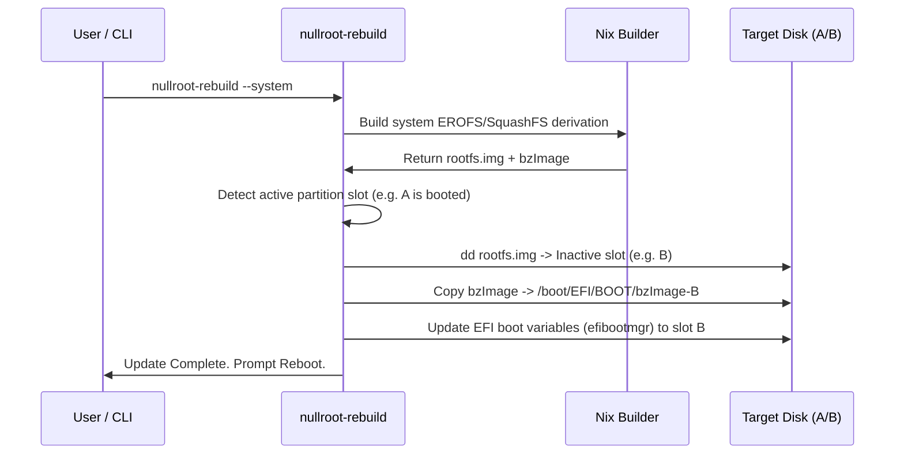

# Nullroot OS: Target Vision and Architecture

Nullroot OS is an independent Linux distribution built from the ground up using **Nix** as its declarative package manager. Its design principles focus on target-specific compiler optimizations, de-GNUification (leveraging Musl libc and Clang/LLVM), and a strict separation of concerns via the "Three Lands" layout.

---

## 1. Core Architectural Pillars

```mermaid
graph TD
    subgraph Boot ["Boot Flow"]
        Firmware[UEFI Firmware] -->|Direct Boot/Secure Boot| UKI[Unified Kernel Image UKI]
        UKI -->|Launches| Stage1[Stage 1 Initramfs]
        Stage1 -->|Mounts Disk & switch_root| Stage2[Stage 2 Init /bin/init]
        Stage2 -->|Launches s6-svscan| s6[s6 Supervision Tree]
    end

    subgraph Userland ["The Three Lands"]
        s6 -. --> Land1[System Land: Immutable Core]
        s6 -. --> Land2[Userland: Declarative Profile]
        s6 -. --> Land3[Isolation Land: Flatpak / Sandbox]
    end

    classDef land1 fill:#e1f5fe,stroke:#0288d1,stroke-width:2px;
    classDef land2 fill:#efebe9,stroke:#5d4037,stroke-width:2px;
    classDef land3 fill:#ede7f6,stroke:#5e35b1,stroke-width:2px;
    class Land1 land1;
    class Land2 land2;
    class Land3 land3;
```

### Pillar 1: Hardware-Targeted Hyper-Optimization
To achieve maximum instruction throughput, cache utilization, and branch prediction efficiency:
* **Target-Local Source Compilation**: Nullroot OS compiles all software from source on the target machine (Gentoo style). Every package is compiled specifically for the host processor's instruction set architecture using flags like `-march=native`, `-O3`, and Link-Time Optimization (`-flto`).
* **Declarative Host Profile**: During bootstrap/installation, a hardware-detection tool (`nullroot-detect`) probes the CPU, GPU, PCI/USB devices, and storage controllers to generate a declarative `hardware.nix` profile.
* **Kernel & Driver Minimization**: The kernel reads `hardware.nix` and compiles *only* the specific drivers and modules required for the active hardware. For example, graphics drivers are compiled solely for the detected GPU model.

### Pillar 2: Musl & LLVM Tooling (De-GNUification)
* **LLVM-First Build**: The entire operating system is compiled using the Clang/LLVM toolchain (`clang`, `lld`, `llvm-ar`, etc.) rather than GNU GCC/binutils.
* **Musl Libc**: Every userland executable is statically or dynamically linked against the lightweight, standards-compliant `musl` C library, avoiding the complexity of `glibc`.
* **Rust-Based Userspace Core (`uutils`)**: Standard GNU Coreutils are fully replaced with **uutils-coreutils** (Rust-based POSIX command implementations). To minimize disk and memory footprint, `uutils` is compiled as a single statically-linked **multicall binary** (busybox style) with commands like `ls`, `cp`, `mv`, `rm`, and `cat` created as symlinks pointing to it. Lightweight `toybox` and `busybox` packages are preserved as secondary backups in the Stage 1 initramfs for early-boot operations. Core init and service supervision are handled by Laurent Bercot's lightweight `s6` suite.

### Pillar 3: The Three Lands
To balance security, declarativeness, flexibility, and compatibility:
1. **System Land (Immutable Core)**:
   * Consists of read-only essential utilities, kernel, initramfs, and init system.
   * Enforced at boot-time by a fully read-only root system (using compressed EROFS).
   * Overlay filesystems (`overlayfs` / `tmpfs`) are mounted over writeable paths like `/var`, `/etc`, and `/tmp`.
2. **Userland (Declarative Profile)**:
   * Provides a customizable personal environment for the user.
   * Managed declaratively but exposed through an imperative wrapper CLI (like `nullroot-install-pkg`). This tool updates the underlying declarative configuration files and triggers Nix profile updates automatically.
   * Supports isolated developer environments (such as nix-shells/nix-develop) that leave the primary user profile untainted.
3. **Isolation Land (Compatibility Container)**:
   * Runs proprietary software (e.g., Steam, Discord, Chrome) or applications requiring GNU/glibc dependencies.
   * Completely decoupled from the host libraries, isolated via containerization/sandboxing (e.g., Flatpak, bubblewrap).

---

## 2. Decided Architectural Specifications

During the architectural alignment process, the following blueprint was solidified:

### 1. Two-Stage Compilation Bootstrap
* **Stage 1 (Media Bootstrap)**: The installation media contains a pre-compiled generic `musl` + `llvm` compiler package.
* **Stage 2 (Local Native stdenv)**: The installer utilizes this bootstrap compiler to compile a native target `stdenv` (with `-march=native`) on the host. This native toolchain is then used to compile the rest of the target operating system.
* **Nixpkgs Stdenv Overlay**: Implement compile overlays on top of `pkgsMusl.llvmPackages.stdenv` that inject:
  ```nix
  NIX_CFLAGS_COMPILE = [ "-march=native" "-O3" "-flto" ];
  NIX_LDFLAGS = [ "-flto" ];
  ```

### 2. Disk Partitioning & Filesystem Layout
The target disk is formatted using a GPT layout with A/B system root partitions:
* **Partition 1 (ESP)**: FAT32, mounted at `/boot`. Contains the signed Unified Kernel Image (`BOOTX64.EFI`).
* **Partition 2 (Root A)**: EROFS read-only rootfs containing System Land A.
* **Partition 3 (Root B)**: EROFS read-only rootfs containing System Land B.
* **Partition 4 (Writable Data)**: Writable Btrfs partition (default) or F2FS (opt-in override).
  * **Btrfs (Default)**: Partition 4 is formatted as Btrfs and configured with subvolumes to isolate write paths: `@nix` (for the Nix store and SQLite database), `@home` (user home directories), `@flatpak` (sandboxed runtimes/applications), and `@var` (system configuration logs). Subvolumes are mounted with transparent ZSTD compression (`compress=zstd:3`) and performance flags (`noatime`, `autodefrag`).
  * **F2FS (Opt-in via `--f2fs`)**: Provides wear-leveling layout optimization and direct directory compression for high-performance NVMe drives.

### 3. Writability & Overlay Configuration
* `/etc` is overlaid via `overlayfs` using a directory in the Writable Data partition (e.g. `/var/lib/overlay/etc`) as the upper directory.
* This allows stateful system-management tools (like `passwd`, network managers) to persist writes cleanly while core configuration files live in the read-only directory `/etc/nullroot`.

### 4. Service & Init Supervision (s6 Nix Module)
Services are declared using a Nix module system in `/etc/nullroot/configuration.nix`:
```nix
services.sshd = {
  enable = true;
  run = "exec /bin/dropbear -F -R";
};
```
The Nix system builder parses these options and automatically compiles them into s6-compatible directories (`run`, `finish`, `notification-fd`) under the read-only `/etc/s6/services/` location, which are loaded by `s6-svscan` at PID 1.

### 5. Land 2: Userland & Developer Isolation
* **Main Packages**: Handled via `~/.config/nullroot/user.nix`.
* **Imperative CLI**: A wrapper CLI tool (`nullroot-install-pkg <pkg>`) adds packages to the declarative config and runs `nix profile install` or `home-manager switch` internally.
* **Developer Isolation**: Compilers, linters, debuggers, and language packages are never installed globally. Instead, developers define local project directories with Nix Flakes and activate them on-demand via `nix develop` or `nix-shell` integrated with `direnv`.

### 6. Land 3: Sandboxed Isolation Land
* Host system packages static `flatpak` and `bubblewrap` compiled for Musl.
* All glibc runtime dependencies are encapsulated inside the Flatpak container runtimes.
* Flatpak installations store files in `/var/lib/flatpak` and user data in `~/.var/app`. Desktop shortcuts (.desktop launchers) are exposed to integration layers.

### 7. Atomic System Updates
`nullroot-rebuild --system` performs updates using the following lifecycle:

On reboot, the system launches the new slot B. A system watchdog marks the boot successful, or falls back to slot A if boot fails.

---

## 3. Bleeding-Edge Optimizations

Nullroot incorporates state-of-the-art optimization and security mechanisms to push performance bounds:

### 1. Link-Time & Binary Layout Optimization
* **LLVM BOLT & Workload Profiling**: Critical host binaries (including the Linux kernel, static Nix, Clang, and shell interpreters) are optimized using LLVM BOLT. Users run `nullroot-bolt-profile` on the active machine to record runtime trace profiles (boot cycles, compilations, and Nix evaluations). On subsequent system builds, the builder utilizes these local profile files to optimize basic block layouts.
* **Mold Linker**: In target-local source builds, Mold replaces standard `lld` for the final link phase of userland packages, dramatically accelerating Gentoo-style rebuild times.

### 2. High-Performance Read-Only Root (EROFS)
* SquashFS is replaced by **EROFS** (Enhanced Read-Only File System) compressed with ZSTD or LZ4-HC. EROFS delivers near-zero metadata overhead, pages directly into the Linux page cache, and eliminates translation latency during random directory access.

### 3. Unified Kernel Images (UKI) & Verified Boot Chain
* **Unified Kernel Image (UKI)**: The kernel, initramfs, cmdline configuration, and splash screen are bundled into a single signed EFI executable (`BOOTX64.EFI`).
* **Self-Signed Secure Boot**: During system installation, a tool `nullroot-secureboot-enroll` generates custom PK, KEK, and db keys and automatically enrolls them into the motherboard firmware NVRAM when UEFI is booted in Setup Mode. Rebuilds sign the UKI executable using the private db key.

### 4. Custom Memory Allocators
* For performance-critical userland workloads (such as Nix evaluations, source compilation, and browsers), the standard `musl` heap allocator is dynamically overridden with Microsoft's **mimalloc** or **jemalloc** using Nix-injected `LD_PRELOAD` wrappers. This delivers accelerated multi-threaded heap allocation speeds without requiring a full OS rebuild when switching allocators.

### 5. Control Flow Integrity (CFI) & Kernel Hardening
* The kernel and critical system utilities are compiled with Clang's control flow integrity flags (`-fsanitize=cfi`). This checks function call signatures dynamically at run-time, preventing return-oriented and jump-oriented exploit payloads.

---

## 4. User Experience (UX) & Peripheral Specifications

### 1. The Interactive TUI Installer (`nullroot-install`)
* **Live Media Boot**: Boots into a clean `dialog`-driven interface instead of a bare prompt.
* **Setup Flow**:
  1. *Disk Selection*: Shows detected NVMe/SATA storage drives, listing sizes and partition status.
  2. *Hardware Check*: Runs `nullroot-detect` visually, presenting dynamic checklists of identified CPUs, GPUs, and network adapters.
  3. *Connectivity & Keys*: Interactive Wi-Fi SSID list selection and Secure Boot key generation prompts.
  4. *Bootstrap Progress*: Rather than dumping compiler printouts, displays a progress bar representing download progress, toolchain compilation status, and remaining package queues.

### 2. Default Shell & Terminal: Nushell + Starship
* **Shell Interface**: The default user interactive login command shell is **Nushell** (`/bin/nu`), providing structured table-based pipelines, syntax highlighting, and visual error indicators. Background orchestration shell scripts, initramfs boot routines, and s6 execution files remain strictly on standard POSIX sh (`/bin/sh` from busybox/toybox) to guarantee operational script compatibility.
* **Command Prompt**: Nullroot embeds **Starship** as the standard shell prompt, auto-configuring indicators for active Git repositories, Nix shells, package versions, and background jobs. A default prompt layout is compiled declaratively from configuration settings into `/etc/starship.toml`, which the user can easily override by placing custom configurations at `~/.config/starship.toml`.

### 3. WLM / Desktop Environment: Hyprland & Login Management
* **Login & Session Management (greetd + seatd)**: Direct graphical boot is handled by `greetd` running `tuigreet` (a console/TUI login prompt) supervised as an s6 service. Hardward/seat access permission management is handled by `seatd` as a system service, bypassing heavy systemd elogind components.
* **Graphical Interface**: Successfully logging in launches **Hyprland**, a Wayland-native dynamic tiling compositor utilizing hardware-accelerated animations, workspaces, blur, and rounded corners, optimized directly for the host GPU.
* **Wayland Sound Architecture (PipeWire + WirePlumber)**: Audio mixing, routing, and Bluetooth sound are handled by **PipeWire** and **WirePlumber** run as user services. They are initialized via Hyprland's `exec-once` directives, fully eliminating the need for `systemd --user` session managers.
* **Connectivity & Daemons**: System connections and device links are run as s6 services:
  * *NetworkManager*: Supervised by s6. Users configure network settings using the interactive terminal-based `nmtui` utility.
  * *BlueZ*: Supervised by s6. Bluetooth pairing and management are controlled via `bluetoothctl` or minimal desktop system tray indicators.

### 4. Compilation Dashboard (`nullroot-rebuild`)
* During local source updates, the output is captured and rendered into a split terminal dashboard:
  * **Top Panel**: Active packages being built in parallel, overall build queue progress (e.g. `[Building 24 / 140]`), and estimated time of completion.
  * **Right Panel**: Hardware monitors showing active CPU usage, frequencies, core temperatures, and RAM occupancy.
  * **Bottom Panel**: Minimized log console that can be expanded to show stdout/stderr warnings from the compiler.

---

## 5. Default Bundle Package Stack

To ensure instant utility on initial install, Nullroot OS pre-configures a harmonized default application suite split strictly across the appropriate system levels:

### 1. Land 1: System Land (Core Essentials)
*   **System Daemons**: `s6`, `seatd`, `dbus` (musl), `wireplumber`, `pipewire`.
*   **Networking**: `NetworkManager`, `iwd`, `BlueZ`, `dropbear` (SSH client/server).
*   **Core Tools**: `uutils-coreutils` (multicall), `toybox`, `busybox`.

### 2. Land 2: Userland (Natively Compiled Musl/LLVM CLI & GUI)
*   **Terminal**: **Kitty** (GPU-accelerated, highly performant, written in Go/C, compiles natively with Musl).
*   **Shell & Prompts**: **Nushell** (login shell), **Starship** (prompt engine).
*   **Text Editors**: **Neovim** (modern, highly extensible modal editor), **Vim** (fallback editor).
*   **Monitoring**: **btop** (premium terminal monitor detailing cores, memories, disk queues, and processes).
*   **File Browser**: **yazi** (blazing-fast terminal file manager written in Rust, leveraging async routines and native image previews in Kitty).
*   **System Info**: **fastfetch** (C-based neofetch replacement, executing in microseconds).
*   **Development / Search**: `git`, `ripgrep` (`rg`), `fd`.
*   **Wayland Shell Utilities**: `waybar` (status bar), `wofi`/`rofi` (compositor application menu launchers), `mako` (notifications).

### 3. Land 3: Isolation Land (Flatpak Sandbox)
To support glibc dependencies and closed-source binaries without polluting the Musl host, these are pre-packaged as flatpaks:
*   **Web Browser**: **Firefox** (Enforces DRM support, such as Widevine, by running in the flatpak's glibc runtime wrapper. A native Musl Firefox breaks DRM streaming on Netflix/Spotify).
*   **IDE**: **VSCodium** (Isolates Electron layers and node dependencies inside a flatpak container).
*   **Media Player**: **VLC** (Bundles full codec packs cleanly within the sandbox).
*   **Client Clients / Gaming**: **Steam** (Runs glibc games via Proton sandboxed), **Discord** (Electron/glibc based).
